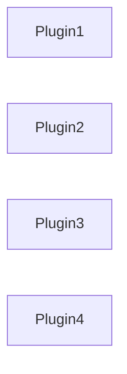
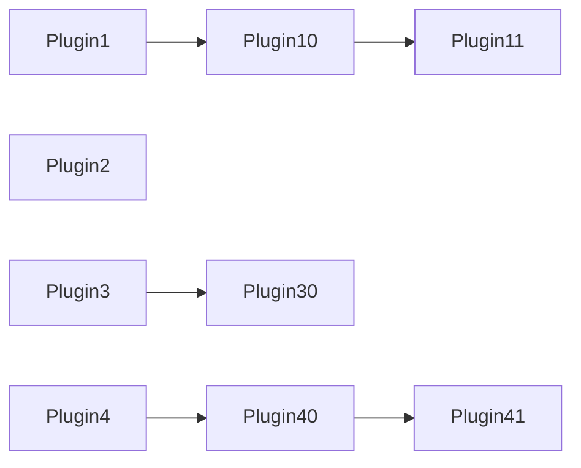
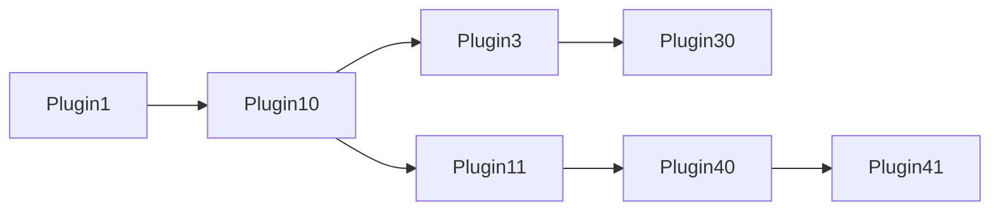
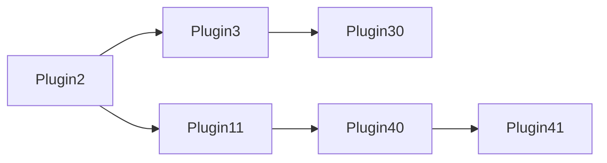
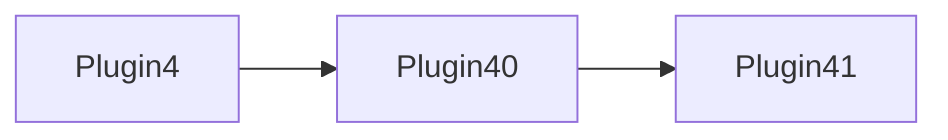
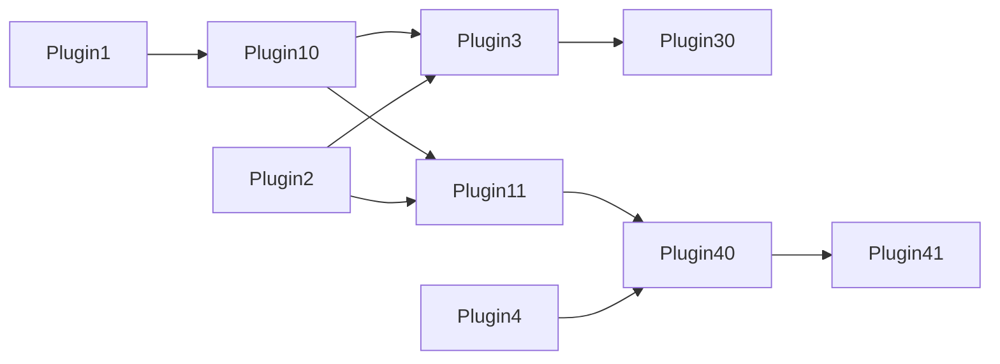
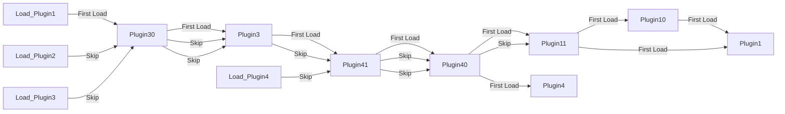
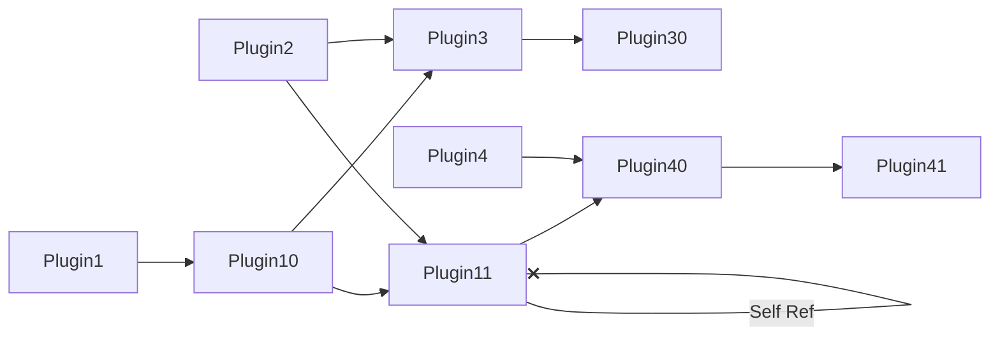
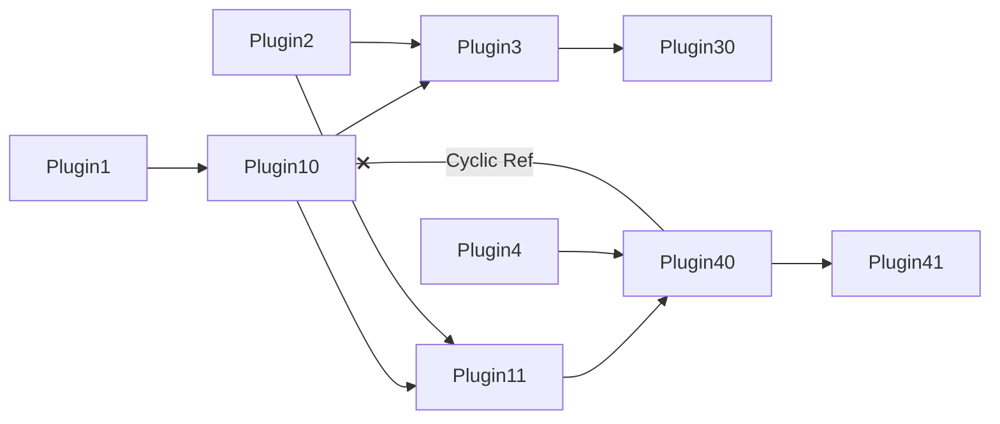

# nfg-util

Utilities, scripts, and library for NFG-based projects.

## Running/Building

For Active Development:

```sh
docker-compose -f ./docker-compose.yml -f ./docker-compose.dev.yml up
```

For a Development bundle:

```sh
docker-compose -f ./docker-compose.yml -f ./docker-compose.dev-build.yml up
```

For a Production bundle:

```sh
docker-compose -f ./docker-compose.yml -f ./docker-compose.prod.yml up
```

### Adding Dependencies

While running in `Active Development` mode, simply exec `npm` or attach into the running container:

```sh
docker exec -it nfg-util npm i -D someutil

#or

docker exec -it nfg-util ash # You're now in a shell!
```

## Files

| Path          | Description                                |
| ------------- | ------------------------------------------ |
| tsconfig.json | Base `tsconfig.json` for all NFG projects. |

## Namespaces

| Namespace | Description                                                            |
| --------- | ---------------------------------------------------------------------- |
| build     | Build toolchain code.                                                  |
| core      | Core/Common Utility functions that are effectively namespace-agnostic. |
| plugin    | ESM-based Plugin Architecture.                                         |


### Plugin Dependency Resolution

Plugins can be either really simple, or entirely too complex. But that's up to you.

Here we'll talk about the approach to dependency resolution, to help demonstrate the flexibility, as well as the potential fallbacks that a developer might run into if they're not careful.

This process takes place across a single collection of [`Manifest`]()s describing their `Behavior`s and their `Accessors` via `*Names`. Each isolated dependency tree is treated *atomically*, meaning if any one plugin in said-tree fails then the entire tree fails. A collection of `Manifest`s can potentially have multiple dependency trees, so this doesn't mean the entire ecosystem fails!

#### Relation Scenarios

With the flexible nature of the Plugin architecture and [Manifest]() configuration, we're able to have anything from extremely simple to highly complex node graphs for a dependency tree.

It should resolve as you'd expect compared to most dependency systems - self and cyclical references are *not allowed* and caught.

However, what makes this Plugin framework unique is the ability to reference a collection of Plugins by a more generic `BehaviorName` instead of an explicit versioned `PluginName`.

> In all scenarios given, `Plugin1` through `Plugin4` are top-level as shown in the `No Dependencies` example.

##### No Dependencies

Simple, sparsest of collections with *all* Plugins having zero dependencies.



##### Simple Dependencies

Still a fairly sparse collection with one or more Plugins having linear dependencies.



We can see in this example that while Plugins have dependencies, they're fairly simple to resolve order. A Breadth-Depth search is performed, and in-order we define the dependency chain until there aren't any leafs left.

The results in the FQN->LoadChainMap directly mirror this chart since there isn't really any complexity, with the exception that when we *actually* instantiate dependencies, it is done in *post*-order to ensure their readiness, as opposed to the previous in-order we used to *detect* the chain.

##### Cross References

In this scenario, we start adding complications by having one depenency graph referencing another.

Let's start with an *unconnected* view view of the manifest topology. Similar to the examples before, we have `Plugin1` through `Plugin4` loaded as top-level `BehaviorName`s for dependency evaluation:





As you can see, `Plugin3` and `Plugin4` still have straight forward depenency trees to be resolved. What you may also see is redundancy in `Plugin1` and `Plugin2`'s dependency trees with these exact same plugins being needed.

The *connected* graph looks like this:



We don't want to load the same plugin correctly, so it's important we resolve it correctly as displayed in the unconnected example, but treat it like the connected example.

As we resolve this tree, we'll end up with a load order of:



##### Erroneous References

As mentioned, there *are* scenarios that just aren't valid: Self and Cyclical References within the dependency tree:

**Self Referenced:**



> Fails both Dependency Trees for `Plugin1` and `Plugin2`, but not `Plugin3` and `Plugin4`.

**Cyclic Reference:**



> Fails Dependency Trees for `Plugin1`, `Plugin2`, and `Plugin4`, but not `Plugin3`.

#### DependencyManager

General Code Flow:

- loadPluginDefinitions()
    - hydrateFqnToMetaMap()
      * Detects previously loaded FQNs, building a failmap
      * Detects duplicate FQNs
      * Throws errors if dupes found earlier
      * Accepts newly discovered plugin metas
    - hydrateBehaviourToMetaMap()
      * Associates Metas mapped by Behavior names
      * Multiple Metas can satisfy a Behavior
    - hydrateAccessorToFqnChainMap()
      * For valid LoaderMetas, detects if any plugins provide desired accessor names,
        throws error if missing
      - getFqnsForBehaviorName() - retrieves all FQNs for a particular Accessor Name
      - getAccessorNamesForMetas() - retrieves unique AccessorNames for all loading Metas
      * Determines all FQNs for Accessors of Dependency MetaLoaders
      <!-- * Error Checks for Self References, and throws -->
      * Error Checks for Cyclical Resolutions, and throws
      * Recursive call if there are any Dependency AccessorNames
    - loadChainMap()
      * Skips already loading/loaded Plugin Instances
      * Recursively Loads, starting at bottom leaf so there's no dependencies needed to start
      - pluginFactory()
        - mapAccessorAliasesToInstances() - returns a mapping of aliases to plugin instances
        * For an FQN, an AccessorAliasInstanceMap mapping will be created that points to all Plugins providing the behavior defined by the AccessorAlias
        * For an FQN, a Plugin Instance will be created
        * Enable Plugin
        * Start Plugin, injecting Host, LoaderManifest, and the new AccessorAliasInstanceMap
